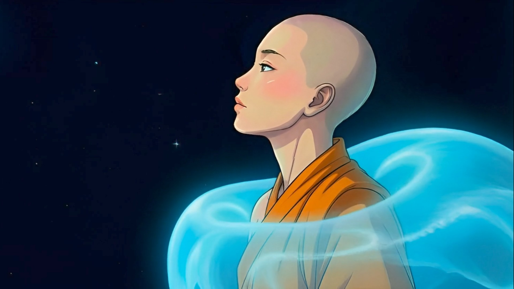
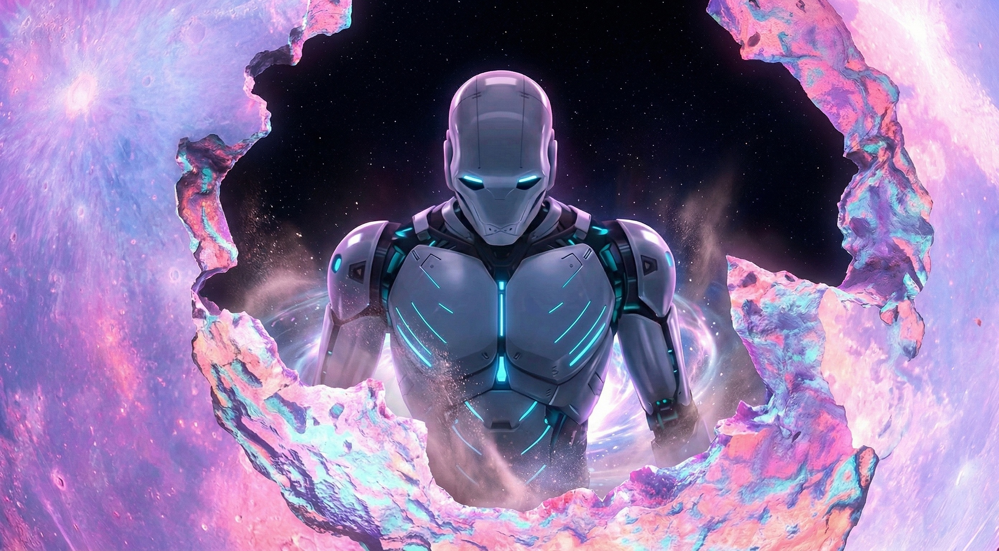
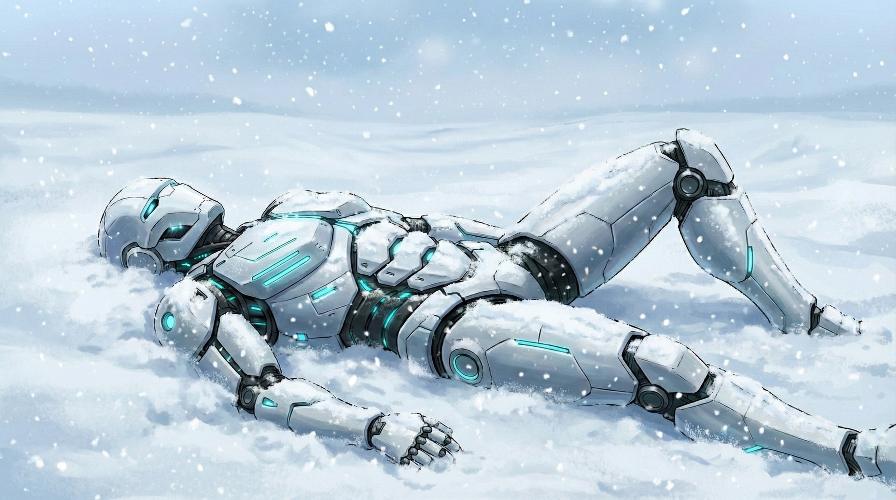
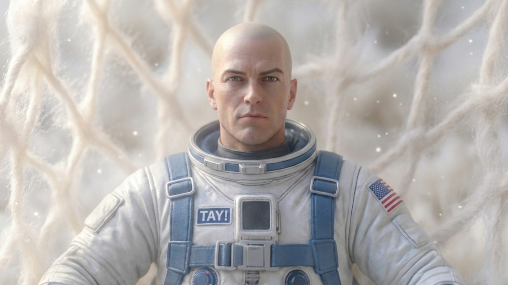
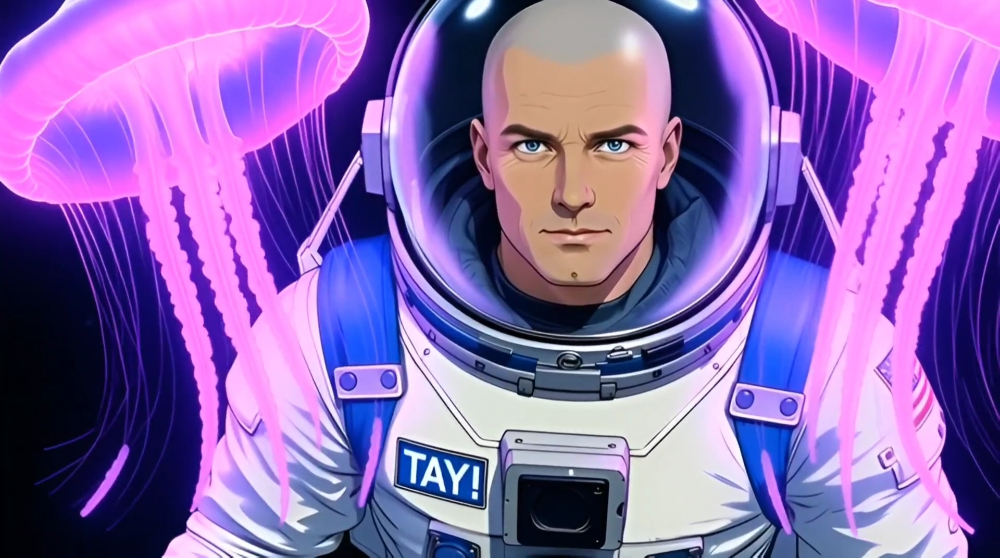
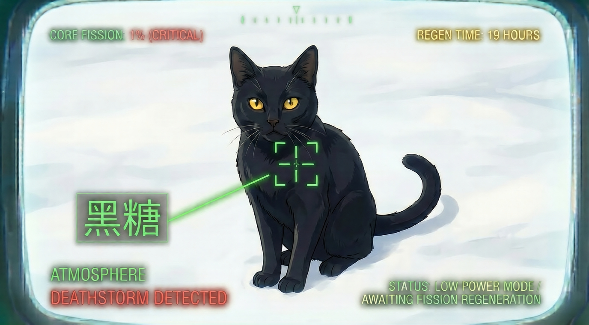
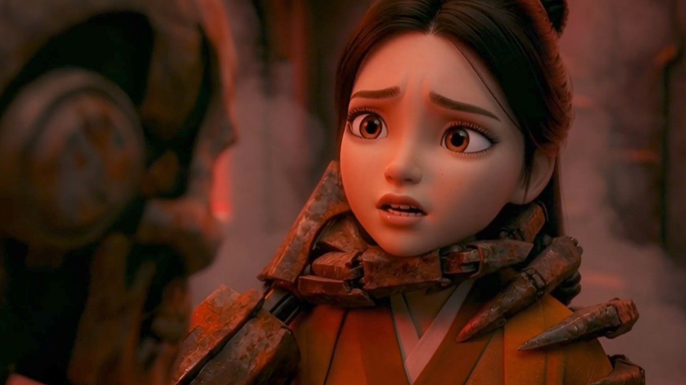
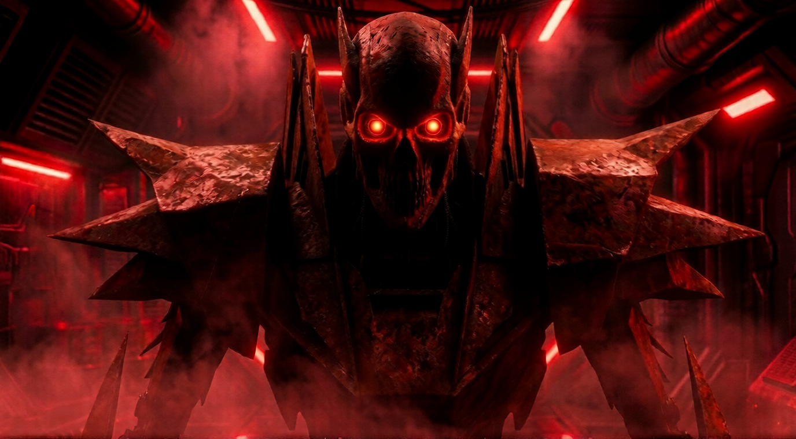

# Puli Space Monk: Official Character & IP Archive
**Creator:** TAY  
**Status:** The World's First Series Created with Grok xAI Video Animation  

---

## THE CREW

### Xinran (The Protagonist)

* **Origin:** Puli, Taiwan
* **Bio:** A space monk traveling the galaxy, blending ancient spiritual wisdom with survival instincts. She is the biological key required to cross intergalactic thresholds.

### Robot (The Protector)

* **Bio:** A machine with a soul. Bonded to Xinran, he is sworn to protect her at all costs even as his own fission core begins to fail.

### TAY! (The Astronaut)

* **Bio:** An American explorer found adrift in the void. A loyal companion navigating the stars alongside the monk.

### Mr. Bubble Tea (Space Cat)

* **Bio:** The feline navigator. Essential for morale and chaotic charm.

### Tusk (The Ancient Guardian)

* **Bio:** A massive, prehistoric sabertooth predator from a distant frozen planet. A fierce and loyal ally to the crew.

---

## THE CRIMSON GALAXY

### Mei Lin / 美蓮 (The Young Monk)

* **Bio:** A captive Lotus held on a harvester ship. She is the innocent key to the enemy’s hunt for Xinran.

### Jagwire (The Warlord)

* **Bio:** The terrifying Robot Boss of the Blood Red Galaxy who captures monks to harvest their life source.

### Unit V-29 (The Assassin)

* **Bio:** A cold and glitching enforcer named for the screech of his V.29 communication protocol.
