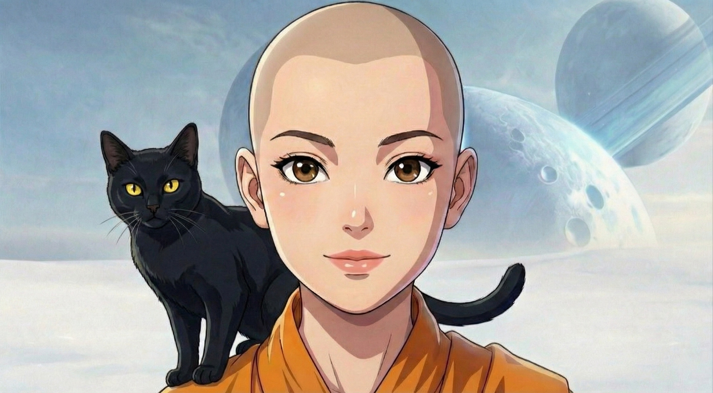
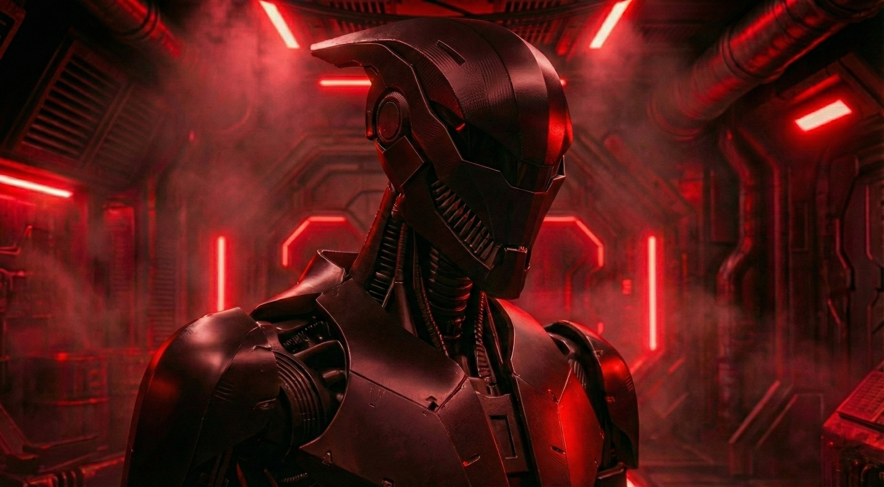

# Puli Space Monk: Official Character & IP Archive
**Creator:** TAY  
**Status:** The World's First Series Created with Grok xAI Video Animation  

---

Puli Space Monk is the first animated series ever created using Grok exclusively for video animation. This project pushes the boundaries of generative storytelling by using xAI's technology to visualize a universe that was previously impossible to film.

In this universe, technology has conquered the stars, but it cannot conquer the boundaries between them. There is a cosmic safeguard written into the fabric of space itself that prevents artificial intelligence from crossing intergalactic thresholds alone. To pass through the void between galaxies, a machine requires a biological signature. They need a human.

This is the story of Xinran, a monk from Puli, Taiwan, who travels beyond time and space. She is not just a passenger. She is the key that unlocks the universe for her protector, a machine with a soul.

---

## THE CREW

### Xinran / 心然 (The Protagonist)

* **Origin:** Puli, Taiwan
* **Bio:** A space monk traveling the galaxy, blending ancient spiritual wisdom with survival instincts. She is the biological key required to cross intergalactic thresholds.

### Robot (The Protector)

* **Bio:** A machine with a soul. Bonded to Xinran, he is sworn to protect her at all costs even as his own fission core begins to fail.

### TAY! (The Astronaut)

* **Bio:** An American explorer found adrift in the void. A loyal companion navigating the stars alongside the monk.

### Mr. Bubble Tea (Space Cat)

* **Bio:** The feline navigator. Essential for morale and chaotic charm.

### Tusk (The Ancient Guardian)

* **Bio:** A massive, prehistoric sabertooth predator from a distant frozen planet. A fierce and loyal ally to the crew.

---

## THE CRIMSON GALAXY

### Mei Lin / 美蓮 (The Young Monk)

* **Bio:** A captive Lotus held on a harvester ship. She is the innocent key to the enemy’s hunt for Xinran.

### Jagwire (The Warlord)

* **Bio:** The terrifying Robot Boss of the Blood Red Galaxy who captures monks to harvest their life source.

### Unit V-29 (The Assassin)

* **Bio:** A cold and glitching enforcer named for the screech of his V.29 communication protocol.

---

## THE ARCHIVES (Episodes 1-5)

### Episode 1: Into the Emotional Void
**Released December 21, 2025 (Winter Solstice)**
The journey begins with Xinran, her highly intelligent robot, and her black cat, Mr. Bubble Tea. They attempt to cross an Emotional Galaxy. This is a region of space where psychic instability manifests as physical danger. The galaxy destabilizes the monk's feelings and draws dangerous monsters to their location. To continue onward, the group is forced to act carefully and make costly sacrifices to survive the crossing.

### Episode 2: Grief's Orbit
**Released December 25, 2025 (Christmas Day)**
Xinran travels through a star system where time itself is distorted. Here she encounters TAY!, a lost American astronaut drifting in the void. His biological presence becomes the catalyst that allows the group to escape the perilous system. However, the laws of this region are strict, and further sacrifices are necessary to propel them toward the next galaxy.

### Episode 3: Echoes of the Mindstorm
**Released December 31, 2025 (New Year's Eve)**
As the Monk and the Robot traverse the frozen singularity known as the Ice Vortex, the physical strain proves too much for the Robot's systems. His emergency fission core begins to overheat and deplete, sending his neural net into a critical cascade. Fighting to stay online and keep Xinran safe, the machine is forced to relive the memory of his own creation and his Genesis.

### Episode 4: Astral Dissonance
**Released January 15, 2026 (Anniversary of the First Space Docking)**
Xinran lands on a desolate alien planet accompanied by Mr. Bubble Tea while her robot companion continues to suffer from critical power drain. In the wilderness they encounter an unexpected friend named Tusk, the sabertooth bear. Xinran realizes they are in a race against time. With the Robot's energy fading, the group must locate shelter and secure their position before an impending tragedy occurs.

### Episode 5: Divinity in Irons (New Release)
**Released February 17, 2026 (Chinese New Year / Year of the Fire Horse)**
The story shifts to the Blood Red Galaxy where the robot warlord Jagwire keeps female monks in cages to harvest their life source. He uses them as batteries to power his fleet's movement through the stars.

Following a chilling interrogation, a young captive monk named Mei Lin (美蓮) is handed over to Unit V-29, a cold assassin named after an ancient communication protocol. Forced into a perilous alliance, Mei Lin is dragged into a mission to locate Xinran, turning the young monk into an unwilling compass for a deadly machine.

---
**The universe is expanding. The hunt for Xinran has begun.**
**Happy Chinese New Year.**
